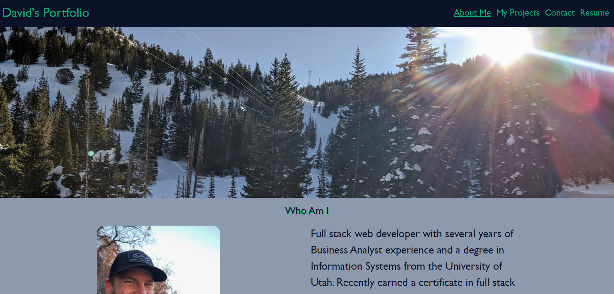
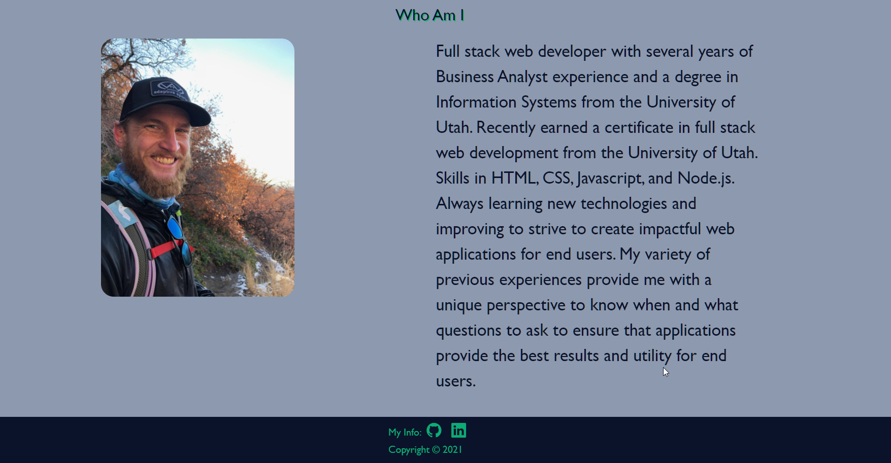
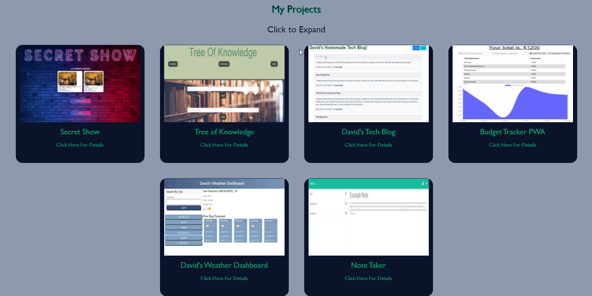
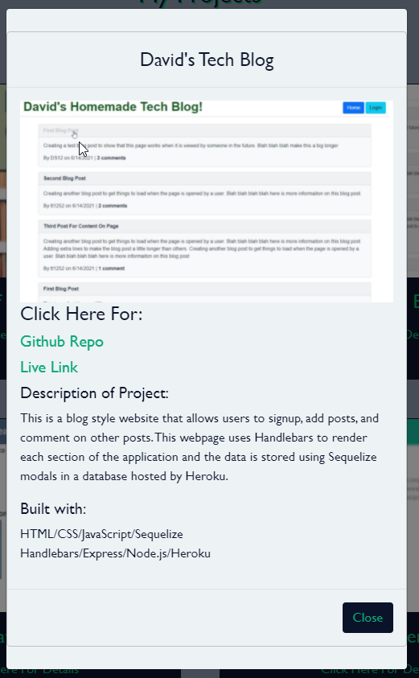
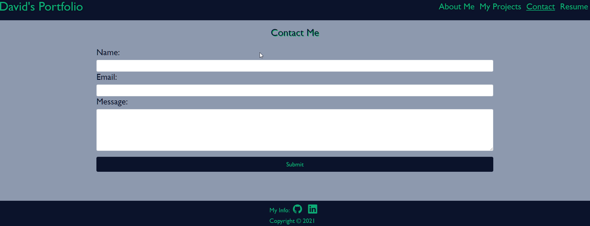
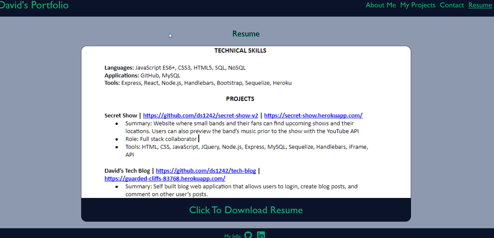

 # David Shaw's Portfolio  

  ## About/Description

  This is a personal portfolio to showcase past projects for potential employers and other individuals.  This portfolio was built using React.js with React-Bootstrap and Bootstrap 5 to help assist with some of the styling and layout. Personal styling was done as well to give it a more unique look and help ensure it's adjustability between mobile and desktop screens. 

  View Page Here: https://david-shaw-portfolio.netlify.app/ 

  ## Table of Contents

  * [Installation](#installation)
  * [Usage](#usage)
  * [Languages](#languages)
  * [Contributing](#contributing)
  * [License](#license)
  * [Tests](#tests)
  * [Questions](#questions)
  
  ## Installation

  To run this locally npm start will kick off the React scripts and load it on a localhost.

  ## Usage

  ### Screenshots of App

  #### Homepage and Navbar on Opening of App

  

  #### About Me Section

  

  #### My Projects

  

  #### Project Modal

  
  
  #### Contact Me

  

  #### Resume 

  

  ## Languages

  Built with React.js

  ## Contributing

  Contributions by: David Shaw

  If you would like to contribute to this project we follow the [Contributor Covenant](https://www.contributor-covenant.org/)

  ## License

  https://choosealicense.com/licenses/mit/

  ## Tests

  Tests were written to help ensure each component renders correct as well as some tests to ensure contained information is correct.  The built in React npm run test will kick off these tests.

  ## Questions:

  If you have any questions please contact us or refer to our github below:

  Email Us At: david.shaw1242@gmail.com

  Github Repo: https://github.com/ds1242/portfolio-react